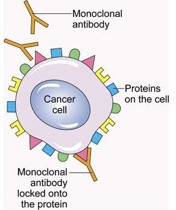

## **Protein as Drug Targets**

# **Introduction** 

The initial step in drug discovery is to identify a disease's biological cause and potential therapeutic targets. A drug target, also known as a "therapeutic target", is a specific molecule in the body, typically a protein or nucleic acid, that is closely associated with a certain disease process and whose activity can be changed by a drug to create a desired therapeutic effect. Potential drug targets are not always disease-causing, but they must be disease-modifying. 

# **Protein as Drug Targets for Cancer** 

The vast majority of drug targets are proteins encoded by genes expressed in diseased tissues. These proteins are critical components of the malignant transformation pathways and, as such, are likely to be a rich source of new cancer drug targets. An example being Bcl-2, a member of an expanding family of proteins that govern programmed cell death (apoptosis). Overexpression of Bcl-2 has been observed in breast cancer, prostate cancer, B-cell lymphomas, colorectal adenocarcinomas, and many other forms of cancer. As a result, Bcl-2 is a promising anti-cancer target (Jain, 2002). Targeted drugs can be classified into two types: small molecules (e.g. small molecule inhibitors) and macromolecules (e.g. monoclonal antibodies, polypeptides, antibody–drug conjugates, and nucleic acids) (Zhong _et al.,_ 2021).

**_Monoclonal Antibodies (MABs)_**: This is a type of targeted drug therapy for cancers. These drugs identify and locate particular proteins on cancerous cells. MABs are duplicates of a single antibody type as the term "monoclonal" means "one type". Different MABs have been made to target different types of cancers indicating each MAB recognizes one particular protein. They work by blocking signals telling cancer cells to divide and grow, which are typically transmitted via receptors which are proteins, by binding to the active sites of the receptors. All MABs have names that include 'mab' at the end of their generic name. For example, trastuzumab (Herceptin) and rituximab (Mabthera).

**Figure 1**: Monoclonal Antibody locked onto a protein on a cancerous cell.

**_Small molecules inhibitors_**: The majority of these inhibitors block protein cancer targets and because of their small size have been successfully used to target extracellular, cell surface ligand-binding receptors, intracellular proteins, and anti-apoptotic proteins, which play an important role in transducing downstream signaling for cell growth and metastasis promotion (Lavanya _et al.,_ 2014).

## **Conclusion** 

Proteins are important drug discovery targets for cancer because malignancy causes a malfunction in the cell's protein machinery. Hence targeting proteins of cancerous cells would bring us closer to finding a cure for cancer.

## **References**

Jain, K. (2002). Proteomics-based Anticancer Drug Discovery and Development. Technology in Cancer Research & Treatment, 1(4), 231-236.

Zhong, L., Li, Y., Xiong, L., Wang, W., Wu, M., Yuan, T., Yang, W., Tian, C., Miao, Z., Wang, T., Yang, S. (2021). Small molecules in targeted cancer therapy: advances, challenges, and future perspectives. Signal Transduction and Target Therapy 6, 201, 1-48.

Lavanya, V., Mohamed Adil, A. A., Neesar, A., Arun, K. R., Shazia, J. (2014). Small molecule inhibitors as emerging cancer therapeutics. Integrated Cancer Science Therapeutics.
