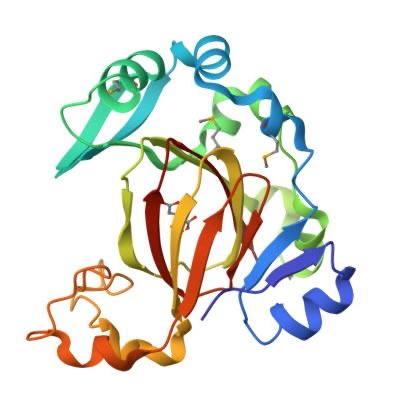
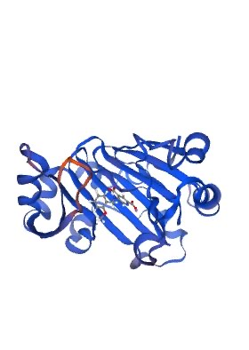
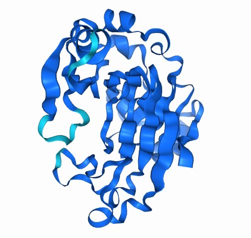
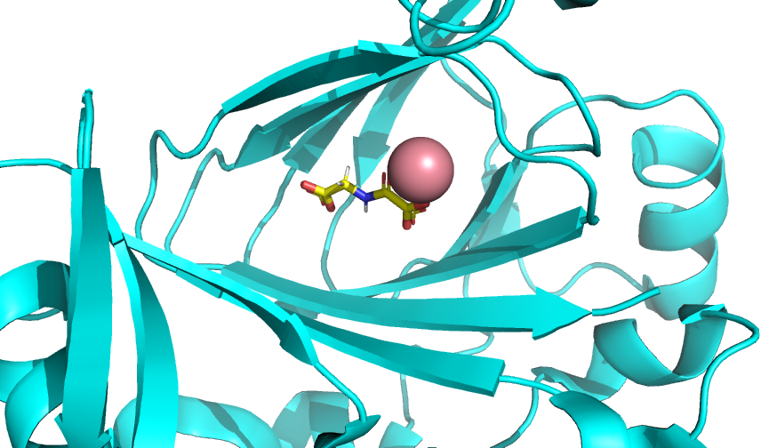
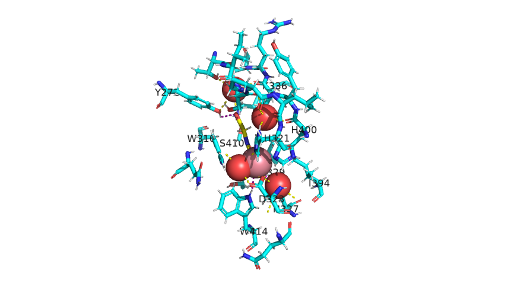
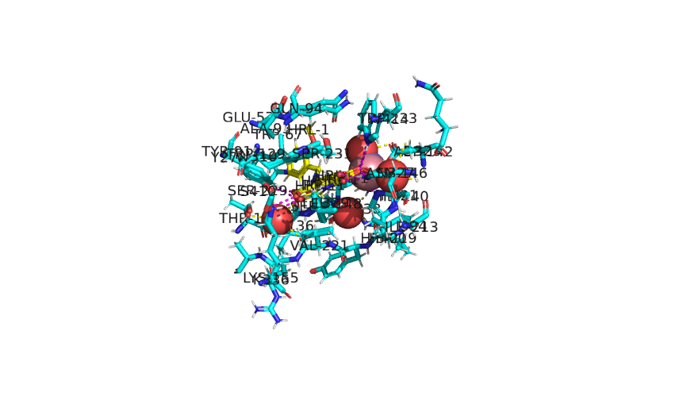
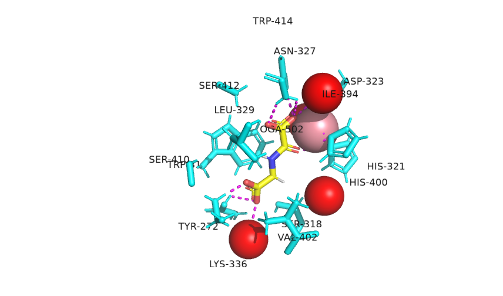

# **HOMOLOGY MODELING (SWISS-MODEL) AND ALPHAFOLD MODELING OF THE 4GJY PROTEIN AND VISUALIZATION USING PYMOL**

Authors (@slack): Bryan Muli (@brayo), Akinkunmi Bamigboye (@akinn), Abeeha Raza (@Abeeha97), Priscilla Fadayini (@Priscillaaa), Samuel Badekale (@SammyB)

## **INTRODUCTION** 

The protein 4GJY represents Jumonji C domain-containing protein 5 (JMJD5), which was initially thought to be a histone demethylase. However, research by Del Rizzo, Krishnan, and Trievel has shown that JMJD5 may have different functions, such as hydroxylating proteins and regulating the cell cycle.

JMJD5 has become important in cancer research because it plays a role in how cells respond to low oxygen levels, a condition known as hypoxia that often occurs in tumors. Specifically, JMJD5 is involved in the hypoxia-inducible factor (HIF) pathway, which helps cancer cells survive and grow in these low-oxygen environments. The 4GJY structure has provided insights into how JMJD5 works; making it a potential target for developing drugs that could slow down tumor growth by targeting this enzyme.

Understanding the structure and function of JMJD5 could lead to new approaches in cancer treatment, by controlling how it affects tumor growth and metastasis. This study aimed to model 4GJY using SWISS-MODEL homology modeling and AlphaFold, comparing the models to the crystal structure to determine which best predicts its cancer-related features.

## **METHODS**

Homology modeling was performed using SWISS-MODEL based on the protein’s (4GJY) sequence. Modeling was also performed using AlphaFold where the AlphaFold server was used to predict the structure of the protein based on its sequence (4GJY). Visualization of all models was carried out using PyMOL to identify key structural features such as the active sites and the mutation sites. This visualization tool also provided the Root Mean Square Deviation (RMSD) between the models which was used to quantify the structural differences.

## **RESULTS AND COMPARISON**

- STRUCTURAL ALIGNMENT AND RMSD

The protein structures were aligned and the RMSD values calculated as follows:

1. SWISS-MODEL (homology model) and PDB model – 0.295

2. AlphaFold model and PDB model- 0.253 

3. AlphaFold model and SWISS-MODEL- 0.244

AlphaFold slightly outperforms the SWISS-MODEL in terms of closeness to the experimental PDB structure, with a lower RMSD (0.253 compared to 0.295). The AlphaFold and SWISS-MODEL are the most similar to each other, as shown by the lowest RMSD (0.244), suggesting that both models are computationally robust with minimal deviations between them. Both the SWISS-MODEL and AlphaFold model are highly similar to the PDB model, which is the experimentally resolved structure.

- LIGAND AND ACTIVE SITE COMPARISON

The PDB structure contains the inhibitor OGA (N-Oxalylglycine) and CO bound in the active site. The SWISS-MODEL contains HRL (5-((2-Methoxybenzyl) amino) pyridine-2,4-dicarboxylic acid) and MN (Manganese(II) ions) bound in the active site. The AlphaFold model did not predict any ligand or ion in the active site of the protein structure.

- ACTIVE SITE AND MUTATION SITES

The PDB contains 14 residues on the active site while the SWISS-MODEL had 21 residues on the active site which were both visualized and any structural deviations observed. From the PDB there were a total of 9 residues that are known to undergo mutagenesis. These were visualized and compared on all the models.

- CONFORMATIONS 

The PDB model is in the antagonist- bound conformation because it has the inhibitor bound which may restrict the active site and also affect the functionality of the protein.

The SWISS-MODEL is the agonist-bound conformation because it is bound to a ligand which makes the model functional.

The AlphaFold model is in the Apo conformation because it does not exhibit any ligand bound. It only shows the protein’s overall structure

    

**Figure 1: PDB structure**

**Figure 2: SWISS-MODEL structure**

**Figure 3: AlphaFold structure**
 

**Figure 4: PDB Ligand**

**Figure 5: PDB Active site with water**

**Figure 6: SWISS-MODEL Active site with water**

**Figure 7: PDB Active site**

## **CONCLUSION** 

This report examined the structure and function of JMJD5, as represented by the 4GJY protein, focusing on its role in cancer research via the HIF pathway. Using homology modeling (SWISS-MODEL) and AlphaFold, we compared their models to the PDB structure. RMSD values showed high similarity, especially for AlphaFold, to the PDB structure. We also analyzed active sites and ligand binding, noting that the PDB structure had an inhibitor, the SWISS-MODEL had a functional ligand, and AlphaFold predicted an unbound state. These insights into JMJD5's conformations provide valuable information for its potential as a cancer drug target.

## **REFRENCES**

Del Rizzo, P. A., Krishnan, S., & Trievel, R. C. (2012). Crystal Structure and Functional Analysis of JMJD5 Indicate an Alternate Specificity and Function. _Molecular Cell Biology_. 32: [4044-4052](tel:4044-4052). <https://doi.org/10.1128/MCB.00513-12> 
